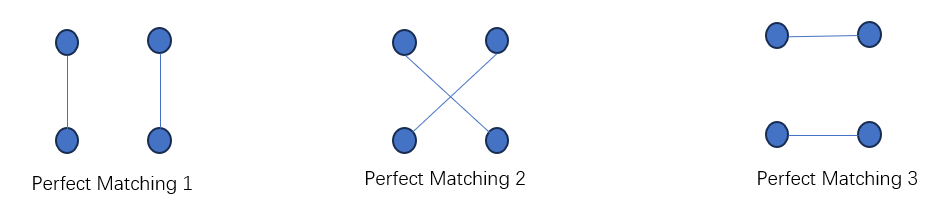
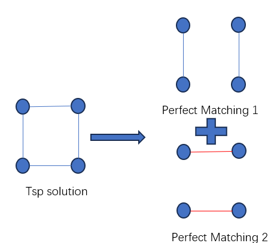
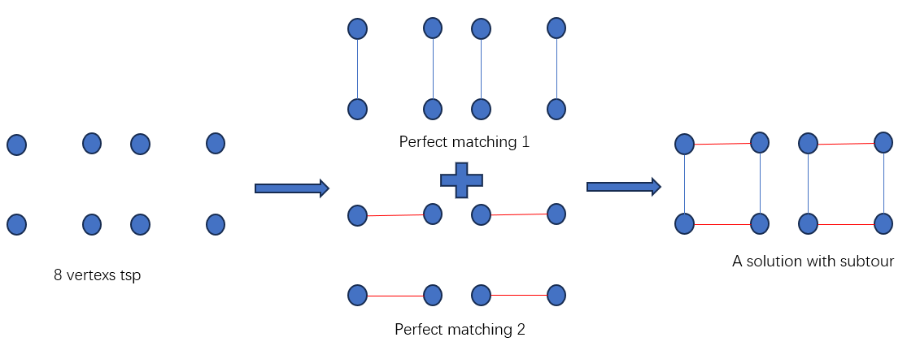

- [English](assets/ReadMe_en.md)
- [中文](assets/ReadMe_zh.md)

---

## Contents
- [Introduction](#introduction)
- [Theory](#2-theory)
  - [Even-vertex TSP Solution = 2 Disjoint Perfect Matchings](#21-even-vertex-tsp-solution--2-disjoint-perfect-matchings)
  - [Mathematical Model](#22-mathematical-model)
  - [Relax Integer Constraints](#23-relax-integer-constraints)
    - [Restricted Master Problem](#231-restricted-master-problem)
    - [Pricing Problem](#232-pricing-problem)
    - [Constraints Generation](#233-constraints-generation)
    - [Procedures](#234-procedures)
  - [Recover Integer Property by Branching](#24-recovering-integer-properties-through-branching)
    - [Naive Branching](#241-naive-branching)
    - [Branching on Edge Flow](#242-branching-on-edge-flow)
    - [Procedures](#243-procedures)
  - [Advanced Topic](#25-advanced-topic)
- [Tested Instances](#3-tested-instances)

## Introduction
**This repository**:
- Solves the Traveling Salesman Problem (TSP) using the Branch-and-Price (BaP) algorithm.
- Visualizes the Branch-and-Price procedure.
- Provides step-by-step versions to solve the problem.

**Visualization Gif** (with speedup)


**Illustration**:
- Dynamically generates the Branch-and-Price tree on the canvas.
- Zoom the canvas by scrolling the mouse wheel.
- Drag and drop the canvas using the right mouse button.
- Inspect a single node by left-clicking it or using the "Locate Node ID" form.
- Track the currently solving node by clicking the "To Track Solving Node" button. Untrack the currently solving node by clicking the "To Untrack Solving Node" button.
- The bottom-left log pertains to the entire Branch-and-Price procedure.
- The top-right information and the bottom-right log pertain to a single node in the Branch-and-Price tree.

**Requirements to Replicate the Repository**:
- **Language**: Python (>=3.7 recommended)
- **Linear Programming (LP) Solver**: [Gurobi](https://www.gurobi.com/academia/academic-program-and-licenses/)
- **Operating System**: Windows/Linux/MacOS
- **Python Packages**:
  - **networkx**:
    - Usage: Stores graphs representing TSP instances and provides graph algorithms such as minimum weight matching and minimum cut.
    - Necessity: Required
    - Installation: `pip install networkx`
  - **gurobipy**:
    - Usage: Python interface to use the Gurobi library.
    - Necessity: Required
    - Installation: `pip install gurobipy`
  - **tkinter**:
    - Usage: Visualization tool.
    - Necessity: Optional if you do not run the visualization version.
    - Installation: Usually bundled with the official Python binary release. If running `python -m tkinter` opens a simple window, it is already installed. Otherwise, refer to the following posts:
      - [Linux: Install Tkinter for Python](https://stackoverflow.com/questions/4783810/install-tkinter-for-python)
      - [How To Install Tkinter In Windows](https://www.activestate.com/resources/quick-reads/how-to-install-tkinter-in-windows)
      - [How Can I Install Tkinter for Python on Mac](https://stackoverflow.com/questions/61218237/how-can-i-install-tkinter-for-python-on-mac)


**How to run code**
- Column generation version
```shell
cd src
python tsp_cg.py
```
- Branch-and-Price without visualization
```shell
cd src
python tsp_BaP.py
```
- Branch-and-Price with visualization
```shell
cd src
python tsp_BaP_vis.py
```

**Credits**:
Based on [jorlib](https://github.com/coin-or/jorlib), this repository:
- Use the same algorithm from jorlib.
- Simplifies the code structure of jorlib, which was heavily encapsulated.
- Adds visualization capabilities.
- Uses Python instead of Java and Gurobi as the LP solver instead of CPLEX.

## 2 Theory

### 2.1 Even-vertex TSP Solution = 2 Disjoint Perfect Matchings 
For a TSP problem with an even number of vertices, any TSP solution can be regarded as two disjoint perfect matchings.
> **What is a perfect matching?**
> 
> 
> A perfect matching is a set of edges such that every vertex in the graph is adjacent to **exactly one edge**.
>
> **What are disjoint perfect matchings?**
> 
> Two perfect matchings are disjoint if they do **NOT** share any common edges.
>
> **Why can any solution of a TSP (with an even number of vertices) be regarded as two disjoint perfect matchings?**
> 
>  
> Any vertex in a TSP solution has a degree of 2 (degree of vertex is the number of edges incident to it). One perfect matching can provide a degree of 1 for a vertex, so two disjoint perfect matchings can provide a degree of 2 for a vertex, forming a TSP solution.
> 
> **Why does this conclusion hold only when the number of vertices is even?**
> 
> Perfect matchings do **NOT** exist when the number of vertices is odd.
>
> **What if the number of vertices is odd?**
> 
> Construct an additional virtual vertex overlapping with an arbitrary vertex. This creates an even number of vertices and yields an equivalent optimal value/solution for the original TSP problem.

### 2.2 Mathematical model
**Notation:**
- $V$: Vertex set of the TSP problem
- $n$: Number of vertices
- $E$: Edge set of the TSP problem
- $m$: An index representing a perfect matching
- $M$: Set of perfect matchings
- $a_{em}$: A parameter indicating whether perfect matching $m$ contains edge $e$
- $c_{m}$: Cost of perfect matching $m$
- $\delta(S)$: Set of edges connecting vertex set $S$ and vertex set ($V \setminus S$)
- $\lambda_{m}$: Variable indicating whether perfect matching $m$ is used

**Model**

$$\min \sum_{m\in M} c_{m}\lambda_{m}$$

$$\sum_{m\in M}\lambda_{m} \geq 2 \quad (1)$$

$$\sum_{m\in M}a_{em}\lambda_{m} <= 1, \forall e \in E \quad (2)$$

$$\sum_{e\in \delta(S)}[\sum_{m\in M}a_{em}\lambda_{m}]>=2, \forall S\subset V \quad (3)$$

$$\lambda_{m}\in \{0,1\}, \forall m\in M \quad (4)$$

- **Constraint (1)** requires exactly two perfect matchings ($\geq$ can be changed into $=$).
- **Constraints (2)** require the perfect matchings to be disjoint.
- **Constraints (3)** are the famous Dantzig–Fulkerson–Johnson (DFJ) subtour elimination constraints. They ensure that for every subset $S$ ($S \subset V$), there is at least one in-flow and one out-flow to another subset ($V \setminus S$).

> Example that subtours occur
> 

- **Constraints (4)** require the variables to be integers.

### 2.3 Relax Integer Constraints

#### 2.3.1 Restricted Master Problem
By relaxing the integer constraints (4), the problem becomes a Linear Programming (LP) problem. We denote this relaxed problem as the **Master Problem** (MP).

Unfortunately, the size of the perfect matching set $M$ is $(n-1)\cdot(n-3)\cdots1$, making it impractical to list all perfect matchings in advance. However, only a few perfect matchings are typically useful (since the number of LP's non-zero variables is less than or equal to the number of constraints). We can start with a small set of perfect matchings and check whether there are other perfect matchings that could improve the objective function. If no such matchings are found, we are done; otherwise, we add these matchings and repeat the process (this is known as **column generation**).

Let $M'$ denote the initial set of a few perfect matchings. Then, we have the following model, which is called the **Restricted Master Problem** (RMP):

$$\min \sum_{m\in \color{red}{M^{\prime}}} c_{m}\lambda_{m}$$

$$\sum_{m\in \color{red}{M^{\prime}}}\lambda_{m} \geq 2 \quad (5)$$

$$\sum_{m\in \color{red}{M^{\prime}}}a_{em}\lambda_{m} <= 1, \forall e \in E \quad (6)$$

$$\sum_{e\in \delta(S)}[\sum_{m\in \color{red}{M^{\prime}}}a_{em}\lambda_{m}]>=2, \forall S\subset V \quad (7)$$

$$\lambda_{m}\in [0,1], \forall m\in \color{red}{M^{\prime}}$$

#### 2.3.2 Pricing Problem
Solving a Restricted Master Problem (RMP) is straightforward, as it is simply a Linear Programming (LP) problem with a clear definition. The key challenge lies in testing whether there are other perfect matchings that could improve the objective function. This can be accomplished by examining the reduced costs.

**Notation**:
- $\pi_{deg2}$: Dual variable of constraint (5)
- $\pi_{e}$: Dual variable of constraints (6) regarding edge $e$
- $\pi_{S}$: Dual variable of constraints (7) regarding subset $S$
- $rc_{m}$: Reduced cost of perfect matching $m$
- $c_{e}$: Cost of edge $e$


The reduced cost of a perfect matching $m$ is given by:

$$rc_{m} = c_{m} - \pi_{deg2} - \sum_{e\in E}a_{em}\pi_{e} - \sum_{S\subset V} [(\sum_{e\in \delta(S)}a_{em})\pi_{S}]$$

Given that $c_{m} = \sum_{e \in E} c_{e}a_{em}$, we can rewrite the reduced cost as:

$$rc_{m} = \sum_{e\in E} c_{e}a_{em} - \sum_{e\in E}\pi_{e}a_{em} - \sum_{e\in E}[(\sum_{S\subset V: e\in \delta(S)}\pi_{S})a_{em}] - \pi_{deg2}$$

$$rc_{m} = \sum_{e\in E}[c_{e}-\pi_{e}-(\sum_{S\subset V: e\in\delta(S)}\pi_{S})]a_{em} - \pi_{deg2}$$

Ideally, we would like to find all perfect matchings with negative reduced costs, but designing an algorithm to find all such matchings can be challenging. A simpler approach is to find the perfect matching with the minimum reduced cost, which can be efficiently solved using graph optimization algorithms.

Since $\pi_{deg2}$ is independent of the perfect matchings, minimizing $rc_{m}$ is equivalent to:

$$\min_{m} \sum_{e\in E}[c_{e}-\pi_{e}-(\sum_{S\subset V: e\in\delta(S)}\pi_{S})]a_{em}$$

$$s.t. \quad m \quad \text{is a perfect matching}$$

Such a problem is a **minimum weight perfect matching** problem and can be solved using the polynomial-time Blossom algorithm. The problem to find negative reduced costs is also called **Pricing Problem**.

> **Minimum Weight Perfect Matching Interpretation**
If we construct a new graph where the cost of edge $e$ is not $c_{e}$, but $c_{e} - \pi_{e} - (\sum_{S \subset V: e \in \delta(S)}\pi_{S})$, the above formulation means finding a perfect matching on the new graph with the minimum cost, which is the definition of a **minimum weight perfect matching** problem.

#### 2.3.3 Constraints Generation
Until now, we've ignored the fact that there are many subsets $S$ (approximately $2^{n}$), which makes it impractical to list all of them in advance. Fortunately, only a few of these constraints are truly tight, so we can start with a small set of constraints and test whether any are violated. If no violations are found, we're done; otherwise, we add the violated constraints and repeat the process (this is known as **constraints generation**).


Considering the Dantzig–Fulkerson–Johnson (DFJ) subtour elimination constraints:

$$\sum_{e\in \delta(S)}[\sum_{m\in M^{\prime}}a_{em}\lambda{m}]>=2, \forall S\subset V$$

Given the values of $\lambda_{m}, m \in M'$ that have been solved, how can we quickly determine whether there exists a subset $S$ that satisfies:

$$\sum_{e\in \delta(S)}[\sum_{m\in M^{\prime}}a_{em}\lambda_{m}] < 2 \quad (8)$$ 

If we attempt to find all $S$ that satisfy (8), it becomes challenging. However, we can aim to calculate the minimal value of $\sum_{e \in \delta(S)}\left[\sum_{m \in M'}a_{em}\lambda_{m}\right]$ across all possible $S$, which can be efficiently solved using a **min cut algorithm** in polynomial time (such as the Stoer-Wagner algorithm).

> **Min-Cut Interpretation**
> 
> Given a subset $S$, if we cut all edges $e$ such that $e \in \delta(S)$, then $S$ will be isolated from $V \setminus S$. The set $\{e: e \in \delta(S)\}$ is called a cut-set, and $\sum_{e \in \delta(S)} cost_{e}$ is called the cut-value.
If we construct a new graph where the cost of edge $e$ is $\sum_{m \in M'}a_{em}\lambda_{m}$, then $\sum_{e \in \delta(S)}\left[\sum_{m \in M'}a_{em}\lambda_{m}\right]$ represents the cut-value of $S$. Thus, finding the minimal value of the cut-value among all $S$ is equivalent to finding the **min-cut** of the new graph.

#### 2.3.4 Procedures
1. **Construct Initial Perfect Matching Set $M'$**
2. **While True:**
   - Solve the Restricted Master Problem.
   - Solve the Pricing Problem to test whether there is a potentially improving perfect matching.
     - **If** such a perfect matching exists:
       - Add the new perfect matching to the Restricted Master Problem.
       - **Continue**
   - Solve the min-cut problem to test whether there is a violated Dantzig–Fulkerson–Johnson (DFJ) subtour elimination constraint.
     - **If** such a constraint exists:
       - Add the violated constraint to the Restricted Master Problem.
       - **Continue**
   - **Break**
3. **Master Problem is Solved**

### 2.4 Recovering Integer Properties through Branching
#### 2.4.1 Naive Branching

Given that we relaxed $\lambda_{m}$ from being binary to continuous, it is likely that the solution to the Master Problem will contain fractional values.

It is known that branching a fractional variable to either $\leq 0$ or $\geq 1$ can eventually lead to an integer solution, for any fractional $\lambda_{m}$, you might consider the following branches:

$$\text{Branch 1}: \lambda_{m} \leq 0$$

$$\text{Branch 2}: \lambda_{m} \geq 1$$

Such a branching scheme has two main drawbacks:
- **Inefficiency**: Only one variable is influenced at a time.
- **Incompatible** with the Pricing Problem.

> **Incompatibility Interpretation**
>Let's focus on $\lambda_{m} \leq 0$, which means perfect matching $m$ should not be used.
Suppose we solve the Restricted Master Problem once, and then we need to solve the Pricing Problem to test whether there is a hopefully improving perfect matching.
>
>Then, how do you ensure that your Pricing Problem does not consider perfect matching $m$?
Optimizing the **minimum weight perfect matching problem** is straightforward, but optimizing the **minimum weight perfect matching problem without considering a specific matching** is more challenging.

#### 2.4.2 Branching on Edge Flow

The edge flow of edge $e$ is given by $\sum_{m\in M^{\prime}}a_{em}\lambda_{m}$.

For graph-based combinatorial problems, a mainstream branching strategy is to branch on fractional edge flows such as:

$$\text{Branch 1}: \sum_{m\in M^{\prime}}a_{em}\lambda_{m} \leq 0$$

$$\text{Branch 2}: \sum_{m\in M^{\prime}}a_{em}\lambda_{m} \geq 1$$

If the edge flow of every edge becomes integer, then every perfect matching variable $\lambda_{m}$ must also be integer (you can try to construct a counterexample if you doubt this).
If the edge flow of a specific edge remains fractional, then there must be a $\lambda_{m}$ that is also fractional.
Therefore, we can shift our focus to branching on edge flows to make them integer.

The advantages of this branching strategy are:
- **Efficiency**: It can constrain multiple variables at once.
- **Compatible** with the Pricing Problem: 

>**Compatibility Interpretation**     
>Considering branching $\sum_{m\in M^{\prime}}a_{em}\lambda_{m} \leq 0$, namely, the edge flow of $e$ being less than zero, we can simply eliminate edge $e$ from the graph when solving the Restricted Master Problem and the Pricing Problem. Importantly, the Pricing Problem remains a **minimum weight perfect matching problem**, but with edge $e$ removed from the graph.
>
>Considering branching $\sum_{m\in M^{\prime}}a_{em}\lambda_{m} \geq 1$, we can replace this constraint with constraint (6) of the Restricted Master Problem. The Pricing Problem remains a **minimum weight perfect matching problem**.
>
> This branching strategy is also commonly used in the Vehicle Routing Problem.

The method of solving the Master Problem using column generation and recovering integer solutions through branching strategy is called **Branch-and-Price** (BaP).

#### 2.4.3 Procedures

1. **Initialize**:
   *To_Solve_Master_Problem* = []

2. **While True**:
   - Choose a Master Problem from *To_Solve_Master_Problem* and solve it.
   - Check whether there is a fractional edge flow.
     - **If** the edge flow of $e$ is fractional:
       - Generate a Master Problem with edge $e$ removed from the graph.
       - Generate a Master Problem with the new constraint $\sum_{m\in M^{\prime}}a_{em}\lambda_{m} \geq 1$.
       - Add both Master Problems to *To_Solve_Master_Problem*.
3. **The Branch-and-Price procedure is finished, and the original problem is solved**.

Note: The above procedure simplifies the handling of infeasible or pruned Master Problems. For a complete implementation, refer to the source code for proper handling of these cases.

### 2.5 Advanced Topic
**Why Branch-and-Price rather than naive TSP formulation + Branch-and-Bound?**

The most naive TSP formulation is:

$$\min \sum_{(i,j)\in E} c_{ij}x_{ij}$$

$$\sum_{j\in V: j\neq i}x_{ij} = 1 \quad \forall i\in V$$

$$\sum_{j\in V: j\neq i}x_{ji} = 1 \quad \forall i\in V$$

$$\sum_{i\in S, j\in S: i\neq j}x_{ij} \leq |S| - 1, \quad \forall S\subset V$$

$$x_{ij}\in \{0,1\}, \quad \forall (i,j)\in E$$

When we relax the integer constraints, the naive model typically has a relatively weak bound, meaning that the objective value of the Master Problem has a relatively large gap with the optimal integer value.

Using perfect matchings as variables offers several advantages:
- **Stronger Bound**: A matching inherently maintains some integer properties (All flows within the matching are the same. If a matching variable is integer, then all flows in the matching are integer). Relaxing such a variable to fractional usually results in a much stronger bound compared to the naive formulation.
- **Avoiding Symmetry Issues**: For the naive model, clockwise and counterclockwise routes are equivalent (a symmetry problem). Solvers cannot automatically detect this equivalence, leading to unnecessary searches. However, since a matching does not include any direction, it does not face this issue and converges to the optimal integer solution more quickly.

These benefits make Branch-and-Price a more effective approach than naive formulation.

**How do we make the Restricted Master Problem as feasible as possible?**

After multiple branchings, the Restricted Master Problem may accumulate several branching constraints.

If the initial perfect matching set $M^{\prime}$ is not sufficiently large, the Restricted Master Problem with many branching constraints may be infeasible at the beginning. This prevents the column generation procedure from continuing, as dual variables and reduced costs do not exist in such a scenario.

An infeasible Restricted Master Problem does not necessarily indicate that the Master Problem itself is infeasible, and it simply means that we have failed to solve the Master Problem correctly.

A simple trick to alleviate this issue is to add high-cost artificial columns (i.e., high-cost perfect matchings in this context) to the Restricted Master Problem. These columns are never deleted by branching constraints.

> **Artificial Columns**:
>
> Considering the branching constraint $\sum_{m\in M^{\prime}}a_{em}\lambda_{m} \leq 0 $, which means the flow on edge $e$ is less than zero, so edge $e$ should be removed from the graph and all perfect matchings containing edge $e$ should be deleted.
>
> However, for artificial columns, they are **not** deleted even if they contain edge $e$. This ensures that the Restricted Master Problem has more initial columns and is as feasible as possible.
>
> Even if a Restricted Master Problem may have non-zero artificial columns, the final solution after the Branch-and-Price procedure will not include artificial columns since they are high-cost, so you won't end up with fractional artificial columns after the Branch-and-Price procedure, unless the original problem itself is infeasible.
>
> However, this trick does not solve all problems. Even if we retain artificial columns in the Restricted Master Problem regardless of the branching constraints added, there may still be cases where too many branching constraints are tight and the initial perfect matchings in $M^{\prime}$ are insufficient, leading to the infeasibility of the Restricted Master Problem (while the Master Problem may be feasible, and we cannot solve it).
>
> To fully address this issue, you may need to introduce slack/surplus variables to test the feasibility of the Master Problem initially (recall how you find an initial feasible basic solution or conclude that the model is infeasible when using the simplex algorithm to solve a LP).

**Can we early stop when solving the Restricted Master Problem?**

In the naive version of column generation, we sequentially solve multiple Restricted Master Problems to solve the Master Problem. However, column generation exhibits a well-known "tailing-off" effect (where adding more columns leads to diminishing improvements in the objective value). Therefore, it is reasonable to early stop the column generation process when the objective value of the Restricted Master Problem is sufficiently close to the objective value (or lower bound) of the Master Problem.

> **Early Stopping Condition**:
>
> Let the objective value of the Master Problem be denoted as $z_{mp}$. If the objective value of the Restricted Master Problem is $z_{rmp}$, the minimal reduced cost among all columns is $rc$, and with a constant $K$ satisfying $\sum_{m\in M}\lambda_{m} \leq K$ for the optimal Master Problem solution, then we have:
>
>
>$$z_{rmp} + K \cdot rc \leq z_{mp} \leq z_{rmp}$$
>
>
> Given that our degree-2 constraint is $\sum_{m\in M}\lambda_{m} \geq 2 $, and this constraint must be tight ($=2$) for the optimal Master Problem solution, we can assure $\sum_{m}\lambda_{m} \leq 2$ for the optimal Master Problem solution. Therefore, letting $K = 2$, we have:
>
>$$z_{rmp} + 2 \cdot rc \leq z_{mp} \leq z_{rmp}$$
>
> Hence, we can early stop the column generation process when the gap between $z_{rmp}$ and $z_{rmp} + 2 \cdot rc$ is small enough.

> **Simple Proof**:
>
> Consider a linear program (LP):
>
>$$\min c^{T}x$$
> 
>$$s.t. \quad Ax \leq b$$
>
> $$x \geq 0$$
>
> When using the simplex algorithm, let $D$ be the set of all variable indices, $N$ be the set of non-basic variable indices, and $rc_{j}$ be the reduced cost of $x_{j}$. The objective value $z$ of the LP satisfies:
>
>$$z = \bar{z} + \sum_{j\in N}rc_{j} \cdot x_{j}$$
>
> $$\bar{z} \text{ is a constant, not a variable}$$
>
> If we allow the non-basic variable $x_{j}$ to take on its optimal value $x_{j}^{op}$ (the optimal solution of the LP), then $z = z^{op}$ (the optimal value of the LP). Thus, $z^{op} = \bar{z} + \sum_{j\in N}rc_{j} \cdot x_{j}^{op}$. Let the minimum reduced cost be $mrc$ (which is non-positive), and $K$ be a constant such that $\sum_{j\in D}x_{j}^{op} \leq K$. Then:
>
>$$\sum_{j\in N}rc_{j} \cdot x_{j}^{op} \geq \sum_{j\in N}mrc \cdot x_{j}^{op} = mrc \sum_{j\in N}x_{j}^{op} \geq mrc \sum_{j\in D}x_{j}^{op} \geq mrc \cdot K$$
>
> Therefore:
>
>$$z^{op} \geq \bar{z} + K \cdot mrc$$
>
> Returning to our problem, $z^{op}$ corresponds to $z_{mp}$ and $\bar{z}$ corresponds to $z_{rmp}$, giving us:
>
>$$z_{rmp} + K \cdot rc \leq z_{mp} \leq z_{rmp}$$

**What's the Order in Which Master Problems Are Searched?**

Since we have a branching scheme, multiple Master Problems will be generated. How do we determine the order in which these Master Problems are searched?

There are two typical searching strategies:

- **Bound-First (Breadth-First)**: Search the Master Problem with the lowest estimated bound (the estimated bound usually inherits from the parent Master Problem's objective value). This strategy can improve the lower bound of the original problem more quickly. The searching process, when visualized, resembles breadth-first search. An example of this is shown below:
  

- **Integer-First (Depth-First)**: Search the Master Problem with the most branching constraints. This strategy can find an integer feasible solution more quickly. The searching process, when visualized, resembles depth-first search. An example of this is shown below:
  


## 3 Tested Instances

### TSPLIB Results

| Filename        | #Vertices | Running Time (s) | #Solved Master Problems | Status         |
|-----------------|-----------|------------------|-------------------------|----------------|
| gr24.tsp        | 24        | 1.13             | 3                       | Optimal Integer|
| fri26.tsp       | 26        | 1.48             | 1                       | Optimal Integer|
| burma14.tsp     | 14        | 0.73             | 1                       | Optimal Integer|
| ulysses16.tsp   | 16        | 0.93             | 1                       | Optimal Integer|
| ulysses22.tsp   | 22        | 1.94             | 1                       | Optimal Integer|
| gr17.tsp        | 17        | 1.18             | 1                       | Optimal Integer|
| gr21.tsp        | 21        | 0.90             | 1                       | Optimal Integer|
| bays29.tsp      | 29        | 8.63             | 19                      | Optimal Integer|
| bayg29.tsp      | 29        | 4.59             | 3                       | Optimal Integer|
| hk48.tsp        | 48        | 16.01            | 3                       | Optimal Integer|
| att48.tsp       | 48        | 43.11            | 12                      | Optimal Integer|
| berlin52.tsp    | 52        | 30.95            | 1                       | Optimal Integer|
| swiss42.tsp     | 42        | 20.54            | 8                       | Optimal Integer|
| dantzig42.tsp   | 42        | 14.87            | 3                       | Optimal Integer|
| gr48.tsp        | 48        | 1218.63          | 333                     | Optimal Integer|

Since the data formats in TSPLIB can vary, you may encounter parsing exceptions when running untested data files.

