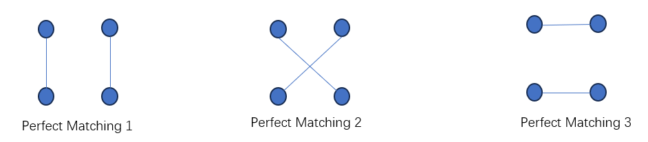
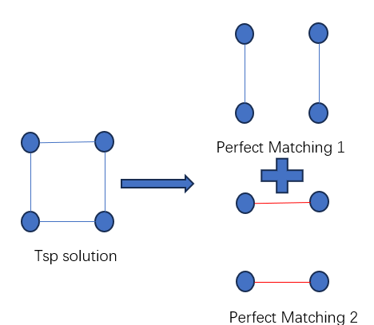
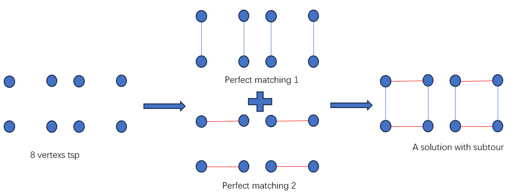
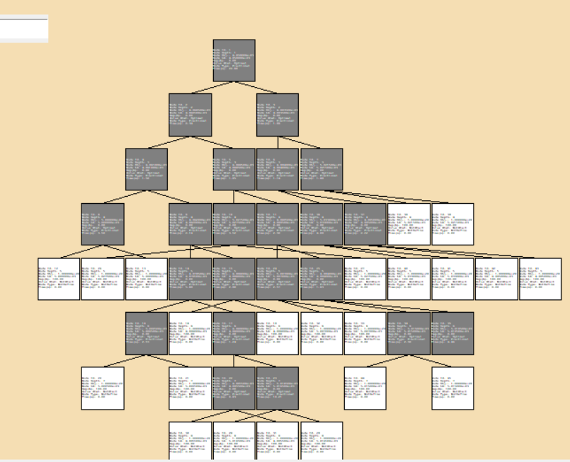
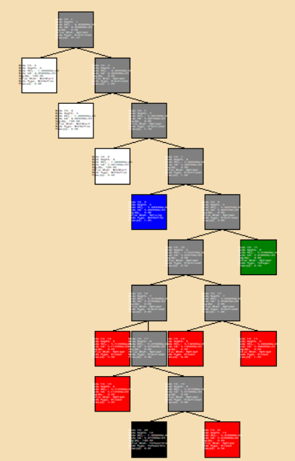

- [English](ReadMe_en.md)

---

# 目录
- [简介](#简介)
- [理论](#2-理论)
  - [偶数顶点TSP解 = 2个不相交的完美匹配](#21-偶数顶点tsp解--2个不相交的完美匹配)
  - [数学模型](#22-数学模型)
  - [松弛整数约束](#23-松弛整数约束)
    - [受限主问题](#231-受限主问题)
    - [定价问题](#232-定价问题)
    - [约束生成](#233-约束生成)
    - [步骤](#234-步骤)
  - [通过分支恢复整数约束](#24-通过分支恢复整数约束)
    - [简单的分支方式](#241-简单的分支方式)
    - [在边流上分支](#242-在边流上分支)
    - [步骤](#243-步骤)
  - [更进一步的话题](#25-更进一步的话题)
- [测试实例](#3-测试实例)

## 简介
**本仓库**:
- 使用Branch-and-Price (BaP) 算法求解旅行商问题 (TSP)。
- 可视化Branch-and-Price 过程。
- 提供逐步解决该问题的版本。

**可视化GIF** (加速播放)


**说明**:
- 动态生成Branch-and-Price树。
- 通过滚动鼠标滚轮缩放画布。
- 使用鼠标右键拖拽画布。
- 单击节点或使用“Locate Node ID”表单来查看单个节点的详细信息。
- 单击“To Track Solving Node”按钮去追踪当前求解节点；单击“To Untrack Solving Node”按钮来取消追踪当前求解节点。
- 左下角的日志涉及整个Branch-and-Price过程。
- 右上角的信息和右下角的日志涉及Branch-and-Price树中的单个节点。

**复现仓库的依赖**:
- **语言**: Python (建议 >=3.7)
- **线性规划 (LP) 求解器**: [Gurobi](https://www.gurobi.com/academia/academic-program-and-licenses/)
- **操作系统**: Windows/Linux/MacOS
- **Python 包**:
  - **networkx**:
    - 用途: 存储表示TSP实例的图，并提供最小权匹配和最小割等图算法。
    - 必要性: 必需
    - 安装: `pip install networkx`
  - **gurobipy**:
    - 用途: 提供用于调用Gurobi库的Python接口。
    - 必要性: 必需
    - 安装: `pip install gurobipy`
  - **tkinter**:
    - 用途: 可视化工具。
    - 必要性: 如果不运行可视化版本，则不必要。
    - 安装: 通常已和Python捆绑。如果运行 `python -m tkinter` 能打开简单的窗口，则早已安装。否则，请参考以下帖子:
      - [Linux: 为Python安装Tkinter](https://stackoverflow.com/questions/4783810/install-tkinter-for-python)
      - [如何在Windows中安装Tkinter](https://www.activestate.com/resources/quick-reads/how-to-install-tkinter-in-windows)
      - [如何为Mac上的Python安装Tkinter](https://stackoverflow.com/questions/61218237/how-can-i-install-tkinter-for-python-on-mac)

**如何运行代码**
- 列生成版本
```shell
cd src
python tsp_cg.py
```
- 不带可视化的Branch-and-Price
```shell
cd src
python tsp_BaP.py
```
- 带可视化的Branch-and-Price
```shell
cd src
python tsp_BaP_vis.py
```

**致谢**:
基于[jorlib](https://github.com/coin-or/jorlib)，本仓库:

- 使用与jorlib相同的算法。
- 简化了jorlib复杂的封装结构。
- 添加了可视化功能。
- 使用Python而非Java，并使用Gurobi而非CPLEX作为LP求解器。

## 2 理论

### 2.1 偶数顶点TSP解 = 2个不相交的完美匹配
对于具有偶数个顶点的TSP问题，任何TSP解都可以视为两个不相交的完美匹配。
> **什么是完美匹配？**
> 
> 
> 
> 一个完美匹配是一个边集，使得图中的每个顶点恰好只和**一条边**相接。
>
> **什么是不相交的完美匹配？**
> 
> 如果两个完美匹配**没有任何共同的边**，则它们是不相交的。
>
> **为什么TSP（具有偶数个顶点）的解可以视为两个不相交的完美匹配？**
>
>    
>
> TSP解的任意顶点的度为2（顶点的度是指与之相邻的边的数量）。一个完美匹配可以为顶点提供为1的度，因此两个不相交的完美匹配可以为顶点提供为2的度，从而形成TSP解。
>
> **为什么这个结论仅在顶点数量为偶数时成立？**
>
> 完美匹配在顶点数量为奇数时**不存在**。
> 
> **如果顶点数量为奇数怎么办？**
>
> 构造一个额外的虚拟顶点与任意一个顶点重合。此时顶点个数为偶数，且和原始TSP问题的最优值/解等价。

### 2.2 数学模型
**符号定义:**
- $V$: TSP问题的顶点集
- $n$: 顶点数量
- $E$: TSP问题的边集
- $m$: 表示一个完美匹配
- $M$: 完美匹配的集合
- $a_{em}$: 参数，表示完美匹配 $m$ 是否包含边 $e$
- $c_{m}$: 完美匹配 $m$ 的成本
- $\delta(S)$: 连接顶点集 $S$ 和顶点集 $(V \setminus S)$ 的边集
- $\lambda_{m}$: 变量，表示是否使用完美匹配 $m$

**模型**

$$\min \sum_{m\in M} c_{m}\lambda_{m}$$

$$\sum_{m\in M}\lambda_{m} \geq 2 \quad (1)$$

$$\sum_{m\in M}a_{em}\lambda_{m} \leq 1, \forall e \in E \quad (2)$$

$$\sum_{e\in \delta(S)}[\sum_{m\in M}a_{em}\lambda_{m}] \geq 2, \forall S\subset V \quad (3)$$

$$\lambda_{m}\in \{0,1\}, \forall m\in M \quad (4)$$

- **约束 (1)** 要求选择两个完美匹配（ $\geq$ 可以改为 $=$ ）。
- **约束 (2)** 要求完美匹配之间互不相交。
- **约束 (3)** 是著名的Dantzig–Fulkerson–Johnson (DFJ) 子环消除约束。对于每个子集 $S$ ( $S \subset V$ )，它和另一个子集 ( $V \setminus S$ )至少有一次流入和一次流出的关系。

> 子环出现的例子
> 

- **约束 (4)** 要求变量为整数。

### 2.3 松弛整数约束

#### 2.3.1 受限主问题
通过松弛整数约束 (4)，问题转化为线性规划 (LP) 问题。这个松弛后的问题称为**主问题** (MP)。

然而完美匹配集 $M$ 的大小为 $(n-1)\cdot(n-3)\cdots1$，从而无法预先列出所有完美匹配。幸运的是，通常只有少数的完美匹配会真正地起作用（回想一下LP非零变量的数量小于或等于约束的数量）。因此可以从少量完美匹配开始，并检验是否存在其他可以改进目标函数的完美匹配。如果没有找到这样的匹配，则求解结束；否则添加这些完美匹配并重复这一过程（这就是**列生成**）。

设 $M'$ 表示初始的一小部分完美匹配。那么得到如下模型，称之为**受限主问题** (RMP):

$$\min \sum_{m\in \color{red}{M^{\prime}}} c_{m}\lambda_{m}$$

$$\sum_{m\in \color{red}{M^{\prime}}}\lambda_{m} \geq 2 \quad (5)$$

$$\sum_{m\in \color{red}{M^{\prime}}}a_{em}\lambda_{m} \leq 1, \forall e \in E \quad (6)$$

$$\sum_{e\in \delta(S)}[\sum_{m\in \color{red}{M^{\prime}}}a_{em}\lambda_{m}] \geq 2, \forall S\subset V \quad (7)$$

$$\lambda_{m}\in [0,1], \forall m\in \color{red}{M^{\prime}}$$

#### 2.3.2 定价问题
解决受限主问题 (RMP) 很简单，毕竟它只是一个定义明确的线性规划 (LP) 问题。关键在于检测是否存在其他可以改进目标函数的完美匹配，这可以通过检验数来实现。

**符号**:
- $\pi_{deg2}$: 约束 (5) 的对偶变量
- $\pi_{e}$: 约束 (6)中关于边 $e$的对偶变量
- $\pi_{S}$: 约束 (7)中关于子集 $S$ 的对偶变量
- $rc_{m}$: 完美匹配 $m$ 的检验数
- $c_{e}$: 边 $e$ 的成本


完美匹配 $m$ 的检验数由下式给出：

$$rc_{m} = c_{m} - \pi_{deg2} - \sum_{e\in E}a_{em}\pi_{e} - \sum_{S\subset V} [(\sum_{e\in \delta(S)}a_{em})\pi_{S}]$$

考虑到 $c_{m} = \sum_{e \in E} c_{e}a_{em}$，我们可以将检验数重写为：

$$rc_{m} = \sum_{e\in E} c_{e}a_{em} - \sum_{e\in E}\pi_{e}a_{em} - \sum_{e\in E}[(\sum_{S\subset V: e\in \delta(S)}\pi_{S})a_{em}] - \pi_{deg2}$$

$$rc_{m} = \sum_{e\in E}[c_{e}-\pi_{e}-(\sum_{S\subset V: e\in\delta(S)}\pi_{S})]a_{em} - \pi_{deg2}$$

理想情况下，我们希望找到所有检验数为负的完美匹配，但设计一个算法来找出所有这样的匹配比较困难。一个更简单的办法是找到检验数最小的完美匹配，这可以通过图优化算法来解决。

由于 $\pi_{deg2}$ 与完美匹配无关，最小化 $rc_{m}$ 等价于：

$$\min_{m} \sum_{e\in E}[c_{e}-\pi_{e}-(\sum_{S\subset V: e\in\delta(S)}\pi_{S})]a_{em}$$

$$s.t. \quad m \quad \text{是一个完美匹配}$$

这样的问题是**最小权完美匹配**问题，可以使用多项式时间的Blossom算法来解决。寻找负检验数的问题也被称为**定价问题**。

> 如果我们构建一个新的图，其中边 $e$ 的成本不是 $c_{e}$，而是 $c_{e} - \pi_{e} - (\sum_{S \subset V: e \in \delta(S)}\pi_{S})$，上述公式意味着在这个新图上找到成本最小的完美匹配，这就是**最小权完美匹配**问题的定义。

#### 2.3.3 约束生成
目前为止，我们忽略了DFJ约束会很多 （大约 $2^{n}$个）。幸运的是，这些约束中只有少数一部分真正起约束作用（称为tight），因此可以从一小部分约束开始，检验是否存在被违反的约束。如果没有找到违反情况，求解结束；否则添加违反的约束到受限主问题中，然后重复这一过程（这就是**约束生成**）。

考虑 Dantzig–Fulkerson–Johnson (DFJ) 子环消除约束：

$$\sum_{e\in \delta(S)}[\sum_{m\in M^{\prime}}a_{em}\lambda{m}] \geq 2, \forall S\subset V$$

给定已求解的 $\lambda_{m}, m \in M'$ ，该如何快速确定是否存在子集 $S$ 满足：

$$\sum_{e\in \delta(S)}[\sum_{m\in M^{\prime}}a_{em}\lambda_{m}] < 2 \quad (8)$$ 

找出所有满足 (8) 的 $S$是困难的，但可以计算所有可能的 $S$ 中 $\sum_{e \in \delta(S)}\left[\sum_{m \in M'}a_{em}\lambda_{m}\right]$ 的最小值，这可以通过**最小割算法**高效地解决。

> **最小割解释**
> 
> 给定一个子集 $S$，如果我们切断所有边 $e$, $e \in \delta(S)$，那么 $S$ 将与 $V \setminus S$ 隔离。集合 $\{e: e \in \delta(S)\}$ 称为割集，而 $\sum_{e \in \delta(S)} cost_{e}$ 称为割值。
>
> 如果我们构造一个新的图，其中边 $e$ 的成本为 $\sum_{m \in M'}a_{em}\lambda_{m}$，那么 $\sum_{e \in \delta(S)}\left[\sum_{m \in M'}a_{em}\lambda_{m}\right]$ 代表 $S$ 的割值。因此，在所有 $S$ 中找到割值的最小值等同于找到新图的**最小割**。

#### 2.3.4 步骤
1. **构建初始完美匹配集合 $M'$**
2. **循环执行:**
   - 解决受限主问题。
   - 解决定价问题来检验是否存在潜在改进的完美匹配。
     - **如果** 存在这样的完美匹配:
       - 向受限主问题添加新的完美匹配。
       - **继续**
   - 解决最小割问题来测试是否存在违反 Dantzig–Fulkerson–Johnson (DFJ) 子环消除约束的情况。
     - **如果** 存在这样的约束:
       - 向受限主问题添加违反的约束。
       - **继续**
   - **结束循环**
3. **主问题求解完成**

### 2.4 通过分支恢复整数约束
#### 2.4.1 简单的分支方式

由于我们将 $\lambda_{m}$ 从0-1变量松弛到了连续型变量，主问题的解很可能包含小数解。

虽然将小数变量分支为 $\leq 0$ 或 $\geq 1$最终总是可以获得整数解，如：

$$\text{分支 1}: \lambda_{m} \leq 0$$

$$\text{分支 2}: \lambda_{m} \geq 1$$

但是这种分支方法有两个主要缺点：
- **效率低下**：每次只影响一个变量。
- **与定价问题不兼容**。

> **不兼容性解释**
>
> 考虑 $\lambda_{m} \leq 0$，它意味着完美匹配 $m$ 不被使用。
>
> 假设求解完受限主问题，需要解定价问题来检验是否存在可能改进的完美匹配，你如何确保定价问题不再考虑完美匹配 $m$？
>
> 单纯地求解最小权完美匹配问题比较简单，但求解**不考虑特定匹配**的最小权完美匹配问题却并不简单！

#### 2.4.2 在边流上分支

边 $e$ 的边流为 $\sum_{m\in M^{\prime}}a_{em}\lambda_{m}$ 。

对于基于图的组合优化问题而言，主流的分支策略是在边流上分支，例如：

$$\text{分支 1}: \sum_{m\in M^{\prime}}a_{em}\lambda_{m} \leq 0$$

$$\text{分支 2}: \sum_{m\in M^{\prime}}a_{em}\lambda_{m} \geq 1 $$

如果每条边的边流都变成了整数，那么每个完美匹配变量 $\lambda_{m}$ 也必定是整数（如果你不信的话，可以自己尝试构造反例）。
如果某条边的边流是小数，那么必定有一个 $\lambda_{m}$ 也是小数。
因此，我们可以将分支的重心转移到让边流变为整数。

这种分支策略的优点是：
- **效率高**：同时约束多个变量。
- **与定价问题兼容**：

> **兼容性解释**     
>
> 考虑分支 $\sum_{m\in M^{\prime}}a_{em}\lambda_{m} \leq 0$，也就是边 $e$ 的边流小于零，要实现这点，可以在解受限主问题和定价问题时从图中移除边 $e$。更重要的是，定价问题依然是一个**最小权完美匹配问题**，仅仅只是从图中去除了边 $e$而已。
>
> 考虑分支 $\sum_{m\in M^{\prime}}a_{em}\lambda_{m} \geq 1$，可以用此约束替换受限主问题中的约束 (6)，此时定价问题依然是一个**最小权完美匹配问题**。
>
> 这种分支策略在车辆路径问题中也被广泛使用。

使用列生成法求解主问题并通过分支策略恢复整数解的方法也被称为 **分支定价法** (Branch-and-Price, BaP)。

#### 2.4.3 步骤

1. **初始化**:
   *待求解的主问题* = []

2. **循环执行**:
   - 从*待求解的主问题*中选择一个主问题并求解。
   - 检查是否有小数边流。
     - **如果** 边 $e$ 的边流是小数:
       - 生成一个移除了边 $e$ 的主问题。
       - 生成一个包含新约束 $\sum_{m\in M^{\prime}}a_{em}\lambda_{m} \geq 1$ 的主问题。
       - 将这两个主问题添加到*待求解的主问题*中。
3. **分支定价法求解结束**。

注：上述步骤简化了主问题无解、或需要剪枝的情况。请参考源代码以了解这些情况是怎样被处理的。

### 2.5 更进一步的话题
**为何选择分支定价法而不是简单的TSP模型化加上分支定界法？**

最简单的TSP模型为：

$$\min \sum_{(i,j)\in E} c_{ij}x_{ij}$$

$$\sum_{j\in V: j\neq i}x_{ij} = 1 \quad \forall i\in V$$

$$\sum_{j\in V: j\neq i}x_{ji} = 1 \quad \forall i\in V$$

$$\sum_{i\in S, j\in S: i\neq j}x_{ij} \leq |S| - 1, \quad \forall S\subset V$$

$$x_{ij}\in \{0,1\}, \quad \forall (i,j)\in E$$

当松弛整数约束时，该模型通常具有较弱的下界，也就是松弛问题的目标值与最优整数值之间存在较大的差距。

而使用完美匹配作为变量提供了几个优势：
- **更紧的下界**：一个完美匹配保持了一些整数特性（完美匹配内的所有边流都相同。如果一个完美匹配的变量是整数，那么该完美匹配的所有边流都是整数）。将这样的变量松弛为小数通常会得到比简单模型更紧的下界。
- **避免对称性问题**：对于简单模型，顺时针和逆时针的路径是等价的（也被称为对称性问题），而求解算法无法自动检测这种等价性，导致搜索多余的路径。然而一个完美匹配不包含任何方向，它没有这种对称性的问题，通常可以更快收敛到最优整数解。

**如何让受限主问题尽可能的feasible？**

经过多次分支后，受限主问题可能会有许多分支约束。

如果初始完美匹配集 $M^{\prime}$ 不够大，带有许多分支约束的受限主问题在一开始可能就是infeasible的。这导致列生成算法无法使用，因为在这种情况下对偶变量和检验数都不存在了。

为了缓解这一问题，一种简单的办法是向受限主问题添加高成本的artificial column。这些列永远不会因分支约束而被删除。

> **artificial column**：
>
> 考虑分支约束 $\sum_{m\in M^{\prime}}a_{em}\lambda_{m} \leq 0$，意味着边 $e$ 上的流小于零，也就是从图中删除边 $e$ ，并且删除所有包含边 $e$ 的完美匹配。
>
> 然而，对于artifical column，即使它们包含边 $e$，也不被删除。这保证了受限主问题有更多的初始列，从而并且尽可能地feasible。
>
> 由于artificial column的成本高，即使主问题的求解结果会让artificial column非零，分支定价法的最终解中也不会包含这些artifical column，因此在运行完分支定价法之后，是不会得到小数的artificial column的，除非原问题本身infeasible。
>
> 但是这个技巧不是万能的，即使在受限主问题中永远保留artifical column，仍然有可能分支约束过多、 而 $M^{\prime}$ 中的初始完美匹配数量不足，导致受限主问题infeasible（但此时主问题却可能是feasible的）。
>
> 为了完全解决这个问题，需要引入松弛/过剩变量来检验主问题的可行性（回想一下当使用单纯形法求解线性规划时，是如何找到初始可行基解或者判定模型infeasible的）。

**解决受限主问题时可以早停吗？**

在最简单的列生成版本中，是通过依次解决多个受限主问题来求解主问题。但列生成通常具有“尾部效应”（列增加得越来越多，但目标值的改善程度越来越小）。因此，当受限主问题的目标值足够接近主问题的目标值（或下界）时，就可以提前停止列生成。

> **提前停止条件**：
>
> 设主问题的目标值为 $z_{mp}$。如果受限主问题的目标值为 $z_{rmp}$，所有列的最小检验数为 $rc$，如果对于主问题的最优解而言存在一个常数 $K$ 满足 $\sum_{m\in M}\lambda_{m} \leq K$ ，那么有：
>
>$$z_{rmp} + K \cdot rc \leq z_{mp} \leq z_{rmp}$$
>
> 考虑约束 $\sum_{m\in M}\lambda_{m} \geq 2$，这个约束对于主问题的最优解而言必定是tight的（也就是 $=2$），因此可以保证对于主问题的最优解而言，有 $\sum_{m}\lambda_{m} \leq 2$。因此，令 $K = 2$，就有：
>
>$$z_{rmp} + 2 \cdot rc \leq z_{mp} \leq z_{rmp}$$
>
> 当 $z_{rmp}$ 和 $z_{rmp} + 2 \cdot rc$ 之间的差距足够小时，就可以提前停止列生成。

> **简单证明**：
>
> 考虑线性规划（LP）：
>
>$$\min c^{T}x$$
> 
>$$s.t. \quad Ax \leq b$$
> 
>$$x \geq 0$$
>
> 使用单纯形法时，设 $D$ 为所有变量索引的集合， $N$ 为非基变量索引的集合， $rc_{j}$ 为 $x_{j}$ 的检验数。LP的目标值 $z$ 满足：
>
>$$z = \bar{z} + \sum_{j\in N}rc_{j} \cdot x_{j}$$
> 
>$$\bar{z} \text{ 为常量}$$
>
> 如果让非基变量 $x_{j}$ 取其最优值 $x_{j}^{op}$（LP的最优解），那么 $z = z^{op}$（LP的最优值）。因此， $z^{op} = \bar{z} + \sum_{j\in N}rc_{j} \cdot x_{j}^{op}$。设最小的检验数为 $mrc$（非正）， $K$ 为常数且满足 $\sum_{j\in D}x_{j}^{op} \leq K$ 。那么有：
>
>$$\sum_{j\in N}rc_{j} \cdot x_{j}^{op} \geq \sum_{j\in N}mrc \cdot x_{j}^{op} = mrc \sum_{j\in N}x_{j}^{op} \geq mrc \sum_{j\in D}x_{j}^{op} \geq mrc \cdot K$$
>
> 因此：
>
>$$z^{op} \geq \bar{z} + K \cdot mrc$$
>
> 回到我们的问题， $z^{op}$ 对应 $z_{mp}$， $\bar{z}$ 对应 $z_{rmp}$，因此：
>
>$$z_{rmp} + K \cdot rc \leq z_{mp} \leq z_{rmp}$$

**主问题的搜索顺序如何确定？**

由于分支方案会生成多个主问题，那么如何确定这些主问题的搜索顺序？

有两种典型的搜索策略：

- **下界优先（广度优先）**：搜索下界估计值最低的主问题（下界估计值通常来自父主问题的目标值）。这种策略可以更快地改善原问题的下界。如果将搜索过程可视化，可以发现它类似于广度优先搜索：
  

- **整数优先（深度优先）**：搜索分支约束最多的主问题。这种策略可以更快地找到整数可行解。如果将搜索过程可视化，可以发现它类似于深度优先搜索：
  

## 3 测试实例

### TSPLIB 数值结果

| 文件名          | 顶点数 | 运行时间 (秒) | 解决的主问题数 | 状态           |
|-----------------|--------|--------------|---------------|----------------|
| gr24.tsp        | 24     | 1.13         | 3             | 最优整数解     |
| fri26.tsp       | 26     | 1.48         | 1             | 最优整数解     |
| burma14.tsp     | 14     | 0.73         | 1             | 最优整数解     |
| ulysses16.tsp   | 16     | 0.93         | 1             | 最优整数解     |
| ulysses22.tsp   | 22     | 1.94         | 1             | 最优整数解     |
| gr17.tsp        | 17     | 1.18         | 1             | 最优整数解     |
| gr21.tsp        | 21     | 0.90         | 1             | 最优整数解     |
| bays29.tsp      | 29     | 8.63         | 19            | 最优整数解     |
| bayg29.tsp      | 29     | 4.59         | 3             | 最优整数解     |
| hk48.tsp        | 48     | 16.01        | 3             | 最优整数解     |
| att48.tsp       | 48     | 43.11        | 12            | 最优整数解     |
| berlin52.tsp    | 52     | 30.95        | 1             | 最优整数解     |
| swiss42.tsp     | 42     | 20.54        | 8             | 最优整数解     |
| dantzig42.tsp   | 42     | 14.87        | 3             | 最优整数解     |
| gr48.tsp        | 48     | 1218.63      | 333           | 最优整数解     |

由于 TSPLIB的数据格式不尽相同，如果运行了未经测试的数据文件，可能会遇到数据解析的异常。